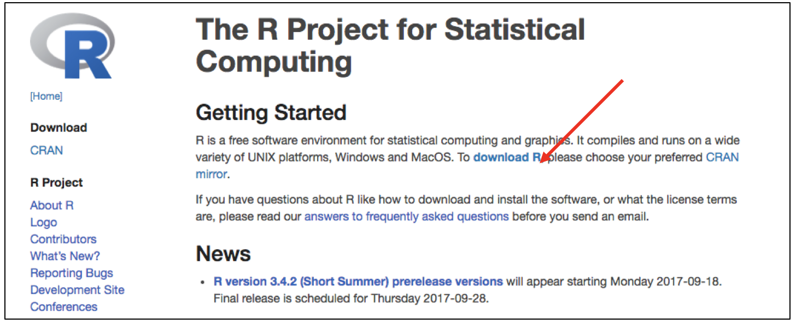
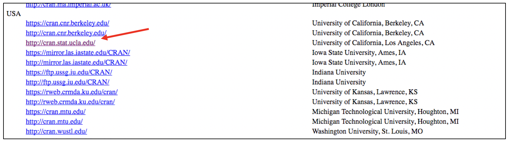
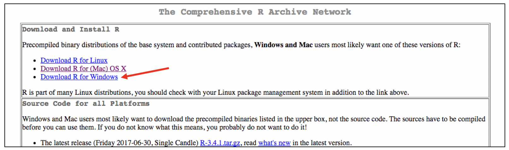
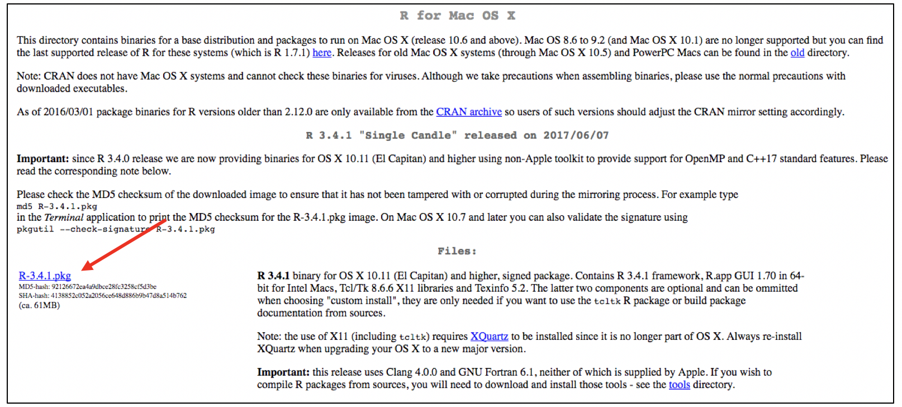
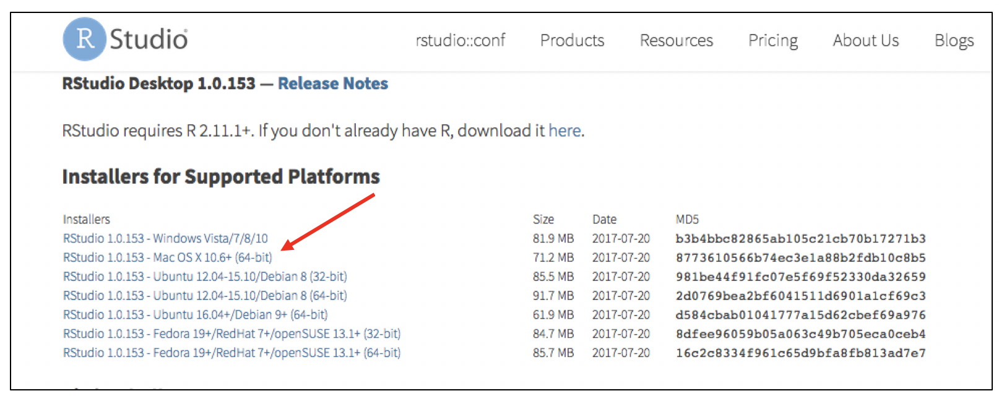

These instructions are to download R and RStudio so that you can use them locally on your machine.

1.	Download R. Go to the [main R page](https://www.r-project.org/).   

&nbsp;  

2.	Click on “download R”.  


&nbsp;  

3.	Pick a CRAN mirror, any CRAN mirror. I usually pick UCLA, because, GO BRUINS! 



&nbsp;  

4.	Choose your operating system  

  
&nbsp;  

5.	Then click on the most recent version on R, at the time these instructions qwere created, R-3.4.1.pkg  

  

&nbsp;  

6.	Finish installing R as you would any new application. This procedure will vary by operating system.  

&nbsp;  

7.	Download RStudio. Go to [this page](https://www.rstudio.com/products/rstudio/download/).   

&nbsp;  

8.	Click the green “Download” button under the free column.  

  

&nbsp;  

9.	Pick your operating system.  

  
&nbsp;  

10.	Finish installing RStudio as you would any new application. This procedure will vary by operating system.  

&nbsp;  

11.	You will ALWAYS open the RStudio application to work, never R. It’s just that you need R installed to use RStudio—R is running in the background whenever you use RStudio.  

&nbsp;  

12. To install the anticipated packages you'll need for this workshop, run the following code:  

```{r, eval = FALSE}
p_needed <- c("tidyverse", "lubridate", "stringr", "devtools", 
              "ggmap", "GGally", "ggbeeswarm",
              "mosaic", "lme4", "nlme", "ppcor", "knitr", 
              "rmarkdown", "markdown", "gee", "haven", 
              "psych","foreign","lavaan")

packages <- rownames(installed.packages())

p_to_install <- p_needed[!(p_needed %in% packages)]

if(length(p_to_install) > 0){
  install.packages(p_to_install)
  }

lapply(p_needed, require, character.only = TRUE)

install_github("RandiLGarcia/dyadr")
library(dyadr)
```

&nbsp;  

13. Enjoy! :)
